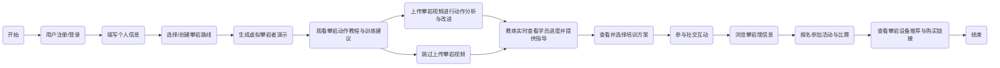

```flow
st=>start: 开始
e=>end: 结束
op1=>operation: 用户注册/登录
op2=>operation: 填写个人信息
op3=>operation: 选择/创建攀岩路线
op4=>operation: 生成虚拟攀岩者演示
op5=>operation: 观看攀岩动作教程
op6=>operation: 上传攀岩视频（可选）
op7=>operation: 教练指导（如有教练）
op8=>operation: 选择培训方案
op9=>operation: 社交互动与分享
op10=>operation: 查看攀岩馆信息
op11=>operation: 查看攀岩设备推荐

st->op1->op2->op3->op4->op5->op6->op7->op8->op9->op10->op11->e
```

```flow
st=>start: Start
op1=>operation: Operation 1
op2=>operation: Operation 2
e=>end: End

st->op1->op2->e

class link flowchart-link
id link1
```




